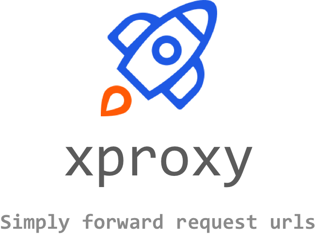
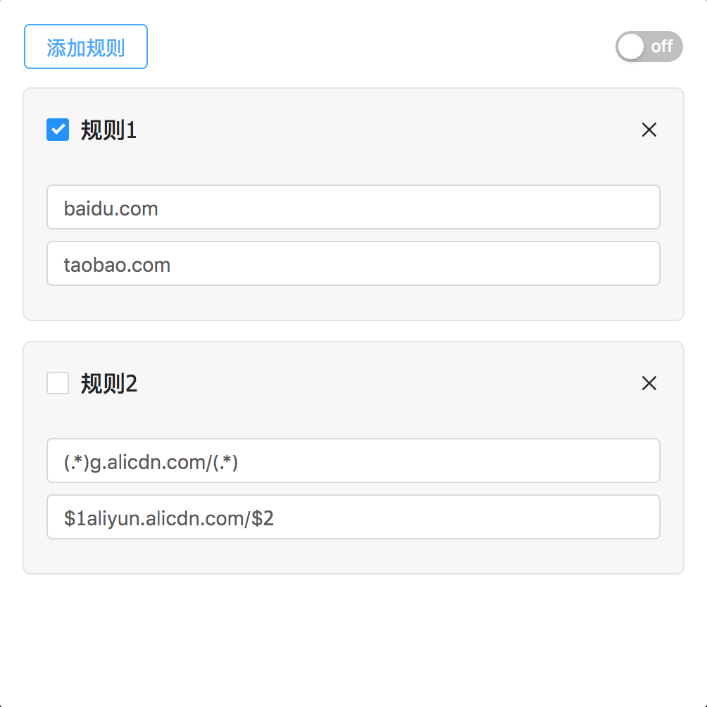

  

A Chrome extension for forward requests by rules which was inspired by [xswitch](https://github.com/yize/xswitch) and reconstruct with React.

## The problem

In the daily development and debugging process, due to the file change of the test environment, the static files on the CDN are needed, and they need to be republished after modification. This is very inefficient and cumbersome. Therefore, it is necessary to forward static files such as CSS and JS on the online or test environment to the local server, so you need a convenient tool that can manage url forwarding.

## Features

- Group switch control
- Flexible single-rule switch control
- Redirect request.url by forwarding rules
- Flexible rules, support for string matching and regular expressions
- Disable browser cache when this tool is activated
- A more friendly UI interface
- Complete unit testing to ensure accuracy of forwarding rules

## Install 

You can download the lastest realease and load unpacked extension in Chrome.

## Usage

  

- rule 1:
request `https://baidu.com` and browser will redirect it to `https://taobao.com`.

- rule 2:
request `https://g.alicdn.com/a.js` and browser will redirect it to `https://aliyun.alicdn.com/a.js`.

more details will be find here: [usages](./doc/usages.md)

tips: only support forwarding http(s) request urls

## License

[MIT](https://opensource.org/licenses/MIT) © [yeshu.lrt](https://xdlrt.github.io/)
