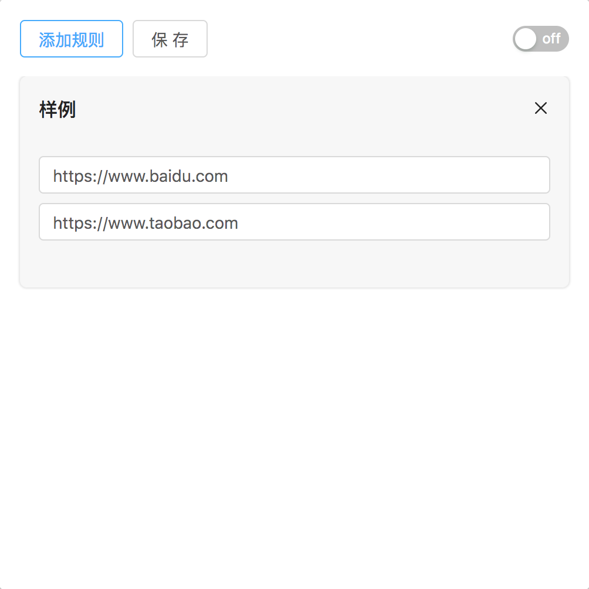

  

# xproxy

A Chrome extension for forward requests by rules which was inspired by [xswitch](https://github.com/yize/xswitch) and reconstruct with React.

## Features

- Group switch control
- Redirect request.url by forwarding rules
- Disable browser cache when this tool is activated
- A more friendly UI interface
- Complete unit testing to ensure accuracy of forwarding rules

## Install 

You can download the lastest realease and load unpacked extension in Chrome.

## Usage

  

visit `www.baidu.com` and Chrome will redirect it to `www.taobao.com`.

## License

[MIT](https://opensource.org/licenses/MIT) © [yeshu.lrt](https://xdlrt.github.io/)
