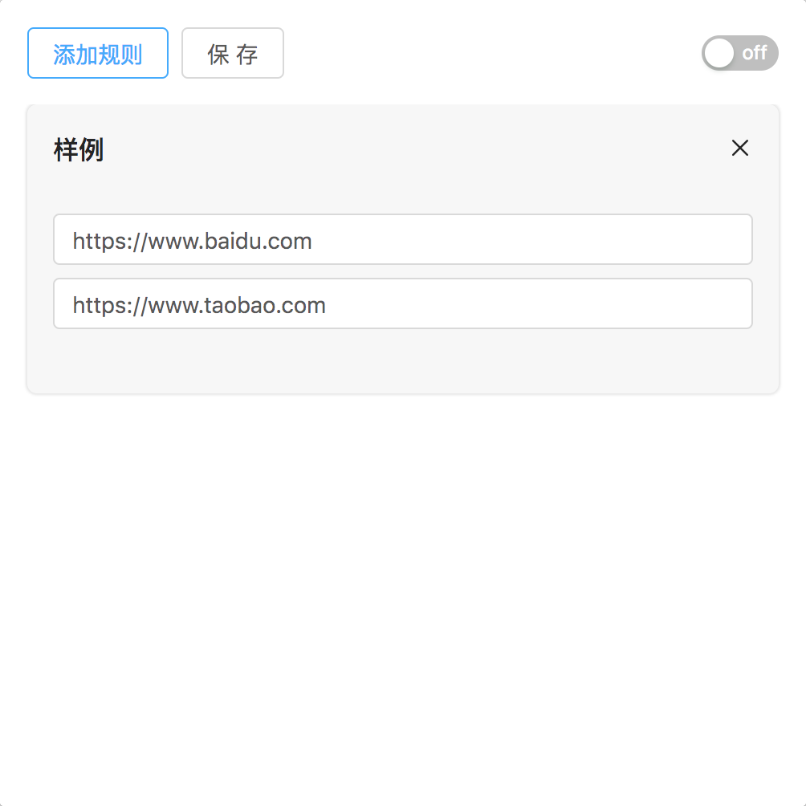

# xproxy

[English README](./README-EN.md)

一个通过制定的规则来重定向请求的 Chrome 浏览器插件，灵感来源于[xswitch](https://github.com/yize/xswitch)，并且利用 React 重构整个项目。

## 特点

- 规则组开关控制
- 通过规则来控制请求的url重定向
- 当此插件生效时禁用浏览器缓存
- UI 界面更加简洁易用
- 完备的单元测试来保障重定向规则的准确性

## 安装 

你可以下载最新的发行版并在 Chrome 浏览器中以未打包的形式安装。

## 使用

访问 `www.baidu.com` 同时 Chrome 浏览器会将它重定向为 `www.taobao.com`.

## License
[MIT](https://opensource.org/licenses/MIT) © [yeshu.lrt](https://xdlrt.github.io/)
